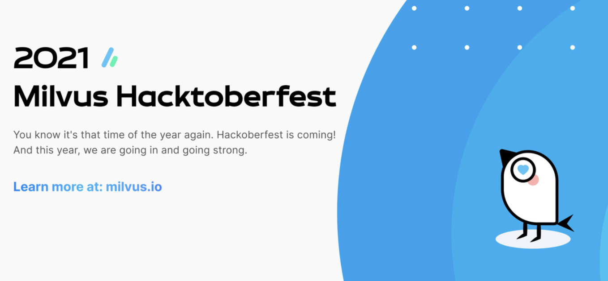
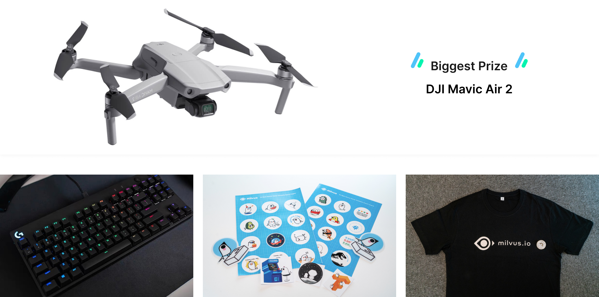

# Milvus To Participate In Hacktoberfest 2021

**Milvus, the vector database empowering AI applications, announced today its participation in the 8th annual Hacktoberfest event sponsored by DigitalOcean!**

In 2014, DigitalOcean initiated [Hacktoberfest](https://hacktoberfest.digitalocean.com/) with the idea of celebrating open source software projects. Through the years, the event has steadily grown from tens to thousands of participants.  This, years the month-long event looks to grow to over 200,000 active participants!  

Starting October 1st, everyone from seasoned developers to students, code newbies and tech writers to UX designers, can contribute to open source communities and develop their skills, with the perks of winning limited edition swag and more.

## Everyone is welcome

There are a lot of ways to contribute to the Milvus project - you don't have to be a code superstar to contribute! In fact, you don't even need an extensive background or long list of skills in order to help out. Are you a great writer or editor, awesome!  Do you like to create graphics or illustrations -  perfect!  Here are a few ways you can make a contribution during the event, along with a list of GitHub "issues" for new contributors to tackle!

Check out the details [here](https://discuss.milvus.io/t/join-hacktoberfest-2021-with-us/72#how-to-participate-1).

## Contribute, get noticed & earn swag

Certainly contributing to open source, or the concept of open source, is in esence an embodiment of altruism, but some cool swag doesn't hurt. We have up for grabs exclusive stickers, t-shirts, keyboards and a drone too! Check out the details on our [forum page](https://discuss.milvus.io/t/join-hacktoberfest-2021-with-us/72#prizes-8).

DigitalOcean also provides swag for participants, check out the rules from the official Hacktoberfest website.

## What's next

* We recently hosted a virtual Q&A call about Hacktoberfest.  You can view the recording [here](https://www.youtube.com/watch?v=cHjSTEHoiF8).

* To participate in the event, we recommend starting on our milvus.io Hacktoberfest page and checking out the ["Quick Start" Guide]( https://milvus.io/hacktoberfest-2021)
* Check out our [GitHub repo]( https://github.com/milvus-io) (and give us a star)!
* View our list of curated ["issues"](https://github.com/milvus-io/milvus/issues?q=is%3Aopen+is%3Aissue+label%3AHacktoberfest) for participants that can help you become a rockstar!

## Helpful links

* [**Milvus x Hactoberfest event page**](https://milvus.io/hacktoberfest-2021)

* [**Milvus Discussion Forum**](https://discuss.milvus.io/c/hacktoberfest/9) - Join our Milvus forum to stay up-to-date on Milvus releases, interact with other users, and ask questions during the event.

* **Follow us on [Twitter](https://twitter.com/milvusio)** and if your contribution is highlighted during the event you could earn special swag!
