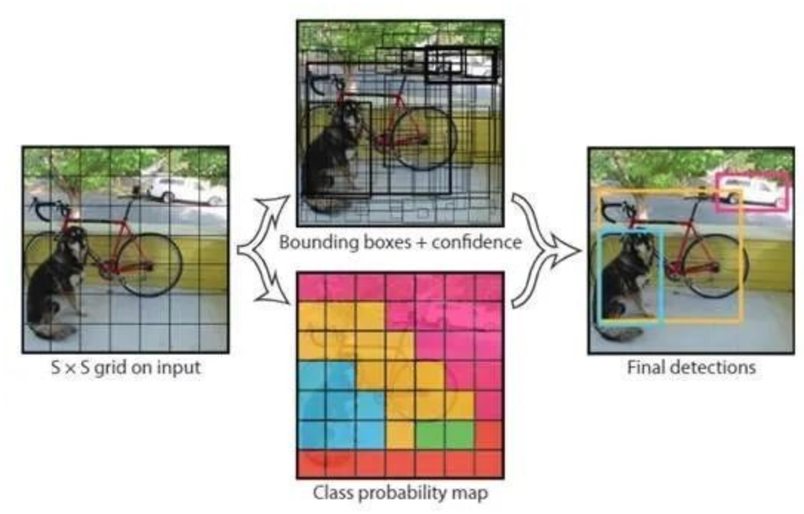
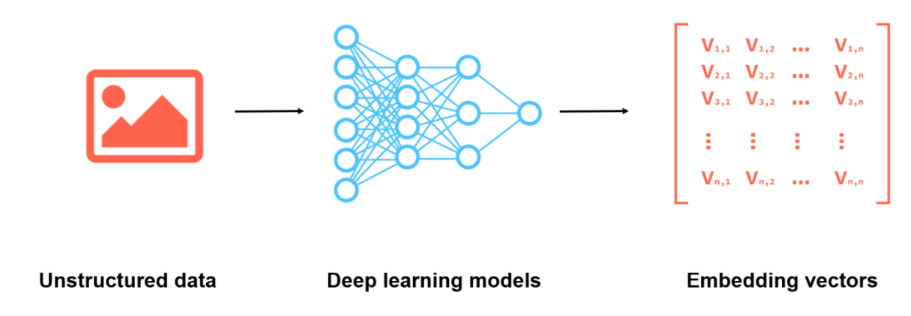
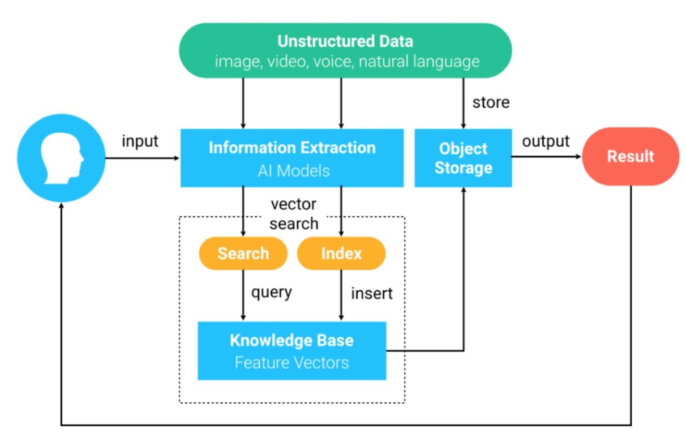
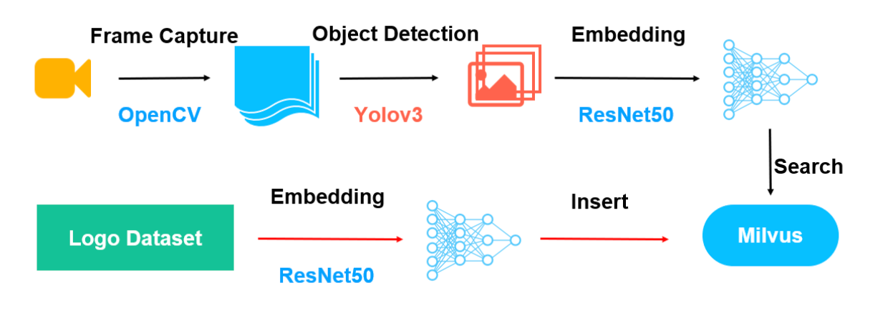

# What is it? Who is she? Milvus helps analyze videos intelligently

> Shiyu Chen, a data engineer at Zilliz, graduated from Xidian University with a degree in Computer Science. Since joining Zilliz, she has been exploring solutions for Milvus in various fields, such as audio and video analysis, molecule formula retrieval, etc., which has greatly enriched the application scenarios of the community. She is currently exploring more interesting solutions. In her spare time, she loves sports and reading.

When I was watching *Free Guy* last weekend, I felt that I'd seen the actor who plays Buddy, the security guard, somewhere before, yet couldn't recall any of his works. My head was stuffed with "who's this guy?" I was sure about having seen that face and was trying so hard to remember his name. A similar case is that once I saw the leading actor in a video having a drink I used to like a lot, but I ended up failing to recall the brand name.

The answer was on the tip of my tongue, but my brain felt completely stuck.

The tip of the tongue (TOT) phenomenon drives me crazy when watching movies. If only there was a reverse image search engine for videos that enables me to find videos and analyze video content. Before, I built a [reverse image search engine using Milvus](https://github.com/milvus-io/bootcamp/tree/master/solutions/reverse_image_search/quick_deploy). Considering that video content analysis somehow resembles image analysis, I decided to build a video content analysis engine based on Milvus.

## Object detection

### Overview

Before being analyzed, objects in a video should be detected first. Detecting objects in a video effectively and accurately is the main challenge of the task. It is also an important task for applications such as autopilot, wearable devices, and IoT.

Developed from traditional image processing algorithms to deep neural networks (DNN), today's mainstream models for object detection include R-CNN, FRCNN, SSD, and YOLO. The Milvus-based deep learning video analysis system introduced in this topic can detect objects intelligently and quickly.

### Implementation

To detect and recognize objects in a video, the system should first extract frames from a video and detect objects in the frame images using object detection, secondly, extract feature vectors from detected objects, and lastly, analyze the object based on the feature vectors.

- Frame extraction

Video analysis is converted to image analysis using frame extraction. Currently, frame extraction technology is very mature. Programs such as FFmpeg and OpenCV support extracting frames at specified intervals. This article introduces how to extract frames from a video every second using OpenCV.

- Object detection

Object detection is about finding objects in extracted frames and extracting screenshots of the objects according to their positions. As shown in the following figures, a bike, a dog, and a car were detected. This topic introduces how to detect objects using YOLOv3, which is commonly used for object detection.




- Feature extraction

Feature extraction refers to converting unstructured data, which is difficult for machines to recognize, to feature vectors. For example, images can be converted to multi-dimensional feature vectors using deep learning models. Currently, the most popular image recognition AI models include VGG, GNN, and ResNet. This topic introduces how to extract features from detected objects using ResNet-50.



- Vector analysis

Extracted feature vectors are compared with library vectors, and the corresponding information to the most similar vectors is returned. For large-scale feature vector datasets, calculation is a huge challenge. This topic introduces how to analyze feature vectors using Milvus.

## Key technologies

### OpenCV 

Open Source Computer Vision Library (OpenCV) is a cross-platform computer vision library, which provides many universal algorithms for image processing and computer vision. OpenCV is commonly used in the computer vision field. 

The following example shows how to capture video frames at specified intervals and save them as images using OpenCV with Python.

```python
import cv2 
cap = cv2.VideoCapture(file_path)   
framerate = cap.get(cv2.CAP_PROP_FPS)   
allframes = int(cv2.VideoCapture.get(cap, int(cv2.CAP_PROP_FRAME_COUNT)))  
success, image = cap.read() 
cv2.imwrite(file_name, image)
```

### YOLOv3

You Only Look Once, Version 3 (YOLOv3 [5]) is a one-stage object detection algorithm proposed in recent years. Compared to the traditional object detection algorithms with the same accuracy, YOLOv3 is twice as fast. YOLOv3 mentioned in this topic is the enhanced version from PaddlePaddle [6]. It uses multiple optimization methods with a higher inference speed.

### ResNet-50

ResNet [7] is the winner of ILSVRC 2015 in image classification because of its simplicity and practicality. As the basis of many image analysis methods, ResNet proves to be a popular model specialized in image detection, segmentation, and recognition.

### Milvus  

[Milvus](https://milvus.io/) is a cloud-native, open-source vector database built to manage embedding vectors generated by machine learning models and neural networks. It is widely used in scenarios such as computer vision, natural language processing, computational chemistry, personalized recommender systems, and more.

The following procedures describe how Milvus works.

1. Unstructured data is converted to feature vectors by using deep learning models and is imported to Milvus.
2. Milvus stores and indexes the feature vectors.
3. Milvus returns the most similar vectors to the vector queried by users.




## Deployment

Now you have some understanding of Milvus-based video analysis systems. The system mainly consists of two parts, as shown in the following figure.

- The red arrows indicate the data import process. Use ResNet-50 to extract feature vectors from the image dataset and import the feature vectors to Milvus.

- The black arrows indicate the video analysis process. First, extract frames from a video and save the frames as images. Second, detect and extract objects in the images using YOLOv3. Then, use ResNet-50 to extract feature vectors from the images. Lastly, Milvus searches and returns the information of the objects with the corresponding feature vectors.



For more information, see [Milvus Bootcamp: Video Object Detection System](https://github.com/milvus-io/bootcamp/tree/master/solutions/video_similarity_search/object_detection). 

**Data import**

The data import process is simple. Convert the data into 2,048-dimensional vectors and import the vectors into Milvus. 

```python
vector = image_encoder.execute(filename)
entities = [vector]
collection.insert(data=entities)
```

**Video analysis**

As introduced above, the video analysis process includes capturing video frames, detecting objects in each frame, extracting vectors from the objects, calculating vector similarity with Euclidean distance (L2) metrics, and searching for results using Milvus.

```python
images = extract_frame(filename, 1, prefix)   
detector = Detector()   
run(detector, DATA_PATH)       
vectors = get_object_vector(image_encoder, DATA_PATH)
search_params = {"metric_type": "L2", "params": {"nprobe": 10}}
results = collection.search(vectors, param=search_params, limit=10)
```

## Conclusion

Currently, more than 80% of the data is unstructured. With the rapid development of AI, an increasing number of deep learning models have been developed for analyzing unstructured data. Technologies such as object detection and image processing have achieved great breakthroughs in both academia and industry. Empowered by these technologies, more and more AI platforms have fulfilled practical requirements.

The video analysis system discussed in this topic is built with Milvus, which can quickly analyze video content.

As an open-source vector database, Milvus supports feature vectors extracted using various deep learning models. Integrated with libraries such as Faiss, NMSLIB, and Annoy, Milvus provides a set of intuitive APIs, supporting switching index types according to scenarios. Additionally, Milvus supports scalar filtering, which increases recall rate and search flexibility. Milvus has been applied to many fields such as image processing, computer vision, natural language processing, speech recognition, recommender system, and new drug discovery.

## References

[1] A. D. Bagdanov, L. Ballan, M. Bertini, A. Del Bimbo. “Trademark matching and retrieval in sports video databases.” Proceedings of the international workshop on Workshop on multimedia information retrieval, ACM, 2007. https://www.researchgate.net/publication/210113141_Trademark_matching_and_retrieval_in_sports_video_databases 

[2] J. Kleban, X. Xie, W.-Y. Ma. “Spatial pyramid mining for logo detection in natural scenes.” IEEE International Conference, 2008. https://ieeexplore.ieee.org/document/4607625 

[3] R. Boia, C. Florea, L. Florea, R. Dogaru. “Logo localization and recognition in natural images using homographic class graphs.” Machine Vision and Applications 27 (2), 2016. https://link.springer.com/article/10.1007/s00138-015-0741-7 

[4] R. Boia, C. Florea, L. Florea. “Elliptical asift agglomeration in class prototype for logo detection.” BMVC, 2015. http://citeseerx.ist.psu.edu/viewdoc/download;jsessionid=5C87F52DE38AB0C90F8340DFEBB841F7?doi=10.1.1.707.9371&rep=rep1&type=pdf 

[5] https://arxiv.org/abs/1804.02767 

[6] https://paddlepaddle.org.cn/modelbasedetail/yolov3 

[7] https://arxiv.org/abs/1512.03385 