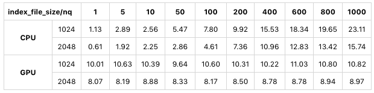
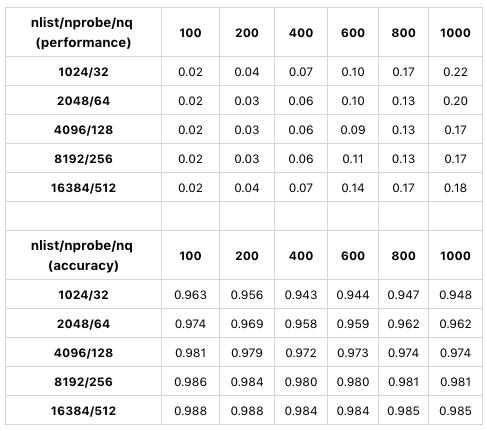

# 如何设置 Milvus 客户端参数

> 作者：莫毅华
>
> 日期：2020-2-26

在上文[如何设置系统配置项](2020-2-19-milvus-config.md)中，针对 Milvus 0.6.0 版本的关键系统配置项给予了详细说明。本文针对 Milvus 0.6.0 版本的客户端关键参数进行详细说明与测试验证，并给予如何设置的建议。
这些参数包括创建表、创建索引、进行搜索时进行的参数设置，它们会对搜索性能产生影响。

## 1. `index_file_size`

在使用客户端创建表时有一个 `index_file_size` 参数，用来指定数据存储时单个文件的大小，其单位为 MB，默认值为1024。我们知道，当向量数据不断导入时，Milvus 会把数据增量式地合并成文件，当某个文件达到 `index_file_size` 所设置的值之后，这个文件就不再接受新的数据，Milvus 会把新的数据存成另外一个文件。这些都是原始向量数据文件，如果建立了索引，则每个原始文件会对应生成一个索引文件，对于 IVFLAT 索引来说，索引文件的大小基本等于对应的原始文件大小，而对于 SQ8 索引来说，索引文件大小大约是原始文件的30%左右。

Milvus 在进行搜索时，是依次对每个索引文件进行搜索。根据我们的经验，当 `index_file_size` 从1024改为2048时，搜索性能会有30%～50%左右的提升。但要注意如果该值设的过大，有可能导致大文件无法加载进显存（甚至内存），比如显存只有2 GB，该参数设为3 GB，显存明显放不下。常用的 `index_file_size` 为1024 MB 和2048 MB。

以下是使用公开测试数据集 sift50m 针对 `index_file_size` 的一个测试，索引类型为 SQ8：

如上图所示，在 CPU 模式和 GPU 模式下，`index_file_size` 设为2048 MB，其搜索性能相对于1024 MB 有显著提高。
 
## 2. `nlist` 和 `nprobe`

`nlist` 是使用客户端创建索引设置的参数，`nprobe` 则是进行搜索设置的参数。我们知道，IVFLAT 和 SQ8 索引都是通过聚类算法把大量的向量划分成很多‘簇’（也可以叫‘桶’），`nlist` 指的就是聚类时划分桶的总数。通过索引查询时，第一步先找到和目标向量最接近的若干个桶，第二步在这若干个桶里通过比较向量距离查找出最相似的k条向量。`nprobe` 指的就是第一步若干个桶的数量。

通常来说，增大 nlist 会使得桶数量变多，每个桶里的向量数量减少，所需的向量距离计算量变小，因此搜索性能提升，但由于比对的向量数变少，有可能会遗漏正确的结果，因此准确率下降；增大 `nprobe` 就是搜索更多的桶数，因此计算量变大，搜索性能降低，但准确率上升。具体情况在面对不同分布的数据集时会产生一些差异，数据集的规模也会影响 `nlist` 和 `nprobe` 的选择。通常情况下，我们推荐的 `nlist` 值为 `4 * sqrt(n)`，其中 n 为数据的向量总数；而 `nprobe` 的值则需要综合考虑在可接受的准确率条件下兼顾效率，比较好的做法是通过多次实验确定一个合理的值。

以下是使用公开测试数据集 sift50m 针对 `nlist` 和 `nprobe` 的一个测试，索引类型为 SQ8：

上图分别是采用不同的 `nlist`/`nprobe` 组合时的搜索性能和准确率对比。因 CPU 和 GPU 测试结果类似，此处仅展示 GPU 测试的结果。在本次测试中，对成比例增长的 `nlist`/`nprobe` 而言，随着他们的增大，准确率呈现上升的趋势，性能则在 `nlist` 为4096和 `nprobe` 为128时呈现最好的情况。因此在实际选择 `nlist` 和 `nprobe` 的值时，需要针对不同数据集，根据用户自己的需求，在速度和准确率两者之间进行合适的取舍。
 
## 总结

`index_file_size`：数据量大于该值时，参数值越大搜索性能越好。
`nlist` 和 `nprobe`：两者结合综合考虑，需用户在性能和准确率之间进行取舍。

