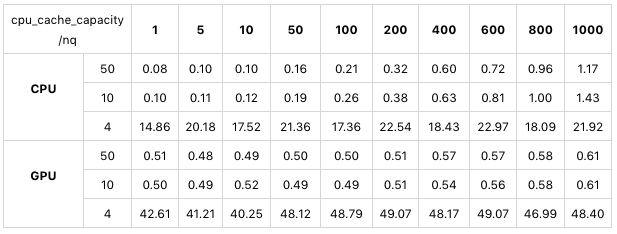
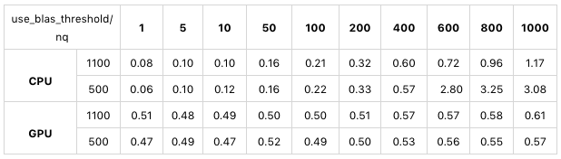
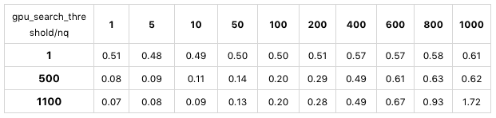

# 如何设置系统配置项

> 作者：莫毅华
>
> 日期：2020-2-19

在[如何选择索引类型 (一)](2019-12-03-select-index.md)中，针对 Milvus 0.5.3 版本和不同用户需求提出了关于选择索引类型的意见。本文针对 Milvus 0.6.0 版本的一些关键系统配置项进行详细说明与测试验证，并给予如何设置的建议。
系统配置项是 Milvus 在启动服务时进行的参数设置，需要在 Milvus docker 镜像启动前对 `server_config.yaml` 文件进行修改。下面我们详细说明几个影响性能的重要参数。

## 1. `cpu_cache_capacity`

`cpu_cache_capacity` 用于限定 Milvus 运行过程中用于缓存向量（索引）数据的内存量，其单位为 GB。设置该值时要根据数据量考虑。数据量怎样计算呢？有两种类型的数据：

- 原始向量数据，没有建立索引前，搜索是基于原始数据的暴力搜索，所需要的内存量就是原始向量的总数据量。向量的每个维度是以 float 来表示的，我们知道每个 float 类型占用4个字节，因此总数据量可以依据这个公式计算：`4 * 向量维度 * 向量总条数`。
- 索引数据，建立好索引后，搜索就会基于索引执行，因此这时需要的内存量就是索引的数据量。不同的索引，占用空间大小是不一样的。对于 IVFLAT，其数据量基本等同于原始向量的总数据量；而对于 SQ8，其数据量大约是原始向量总数据量的30%左右。
 
因此，根据情况设置 `cpu_cache_capacity`，使之大于搜索所需的数据量（前提是机器的内存要足够），搜索性能最佳。但不需要大太多，因为内存足够之后再增大该值并不会产生性能的变化。反之，如果设置的值小于数据量，Milvus会花费大量时间在内存数据的置换上，严重影响查询性能。

关于内存数据的置换，这里解释一下：Milvus 是把向量数据分批保存在磁盘上，默认条件下每个数据文件是 1 GB，假设我们有 10 GB 数据，分成10个数据文件，假设 `cpu_cache_capacity` 设置为 5 GB，当搜索开始时，会将文件数据一个个加载进内存等待计算，当加载完第5个文件后，缓存空间已被占满，开始加载第6个文件时，发现空间不足，于是 Milvus 会将第一个文件数据从内存中删除，从磁盘加载第6个文件数据，这样就保证缓存占用空间不会超过 `cpu_cache_capacity` 所设定的值。相对于索引运算来说，读磁盘是相对比较耗时的操作，因此要尽量避免内存数据的置换。

然后我们来看怎样确定合理的 `cpu_cache_capacity` 值。举例来说，假设导入了1000万条向量，每条向量的维度是256，那么每条向量占用：`256 * 4 = 1024 字节（1 KB）`。原始向量的数据总量为：`1000万 * 1 KB = 10 GB`。如果没有建立任何索引，那么 `cpu_cache_capacity` 的值应该设置为大于10，这样所有的原始向量数据都会被加载进内存，并且不会发生置换。如果建立了索引，对于 IVFLAT 来说，`cpu_cache_capacity` 的值也要设置为大于10；对于 SQ8 来说，其数据量大约为3GB，所以只需把 `cpu_cache_capacity` 设为4就足够。
 
以下是使用公开数据集 sift50m 针对 `cpu_cache_capacity` 的一个测试，索引类型为 SQ8。这个数据集有5000万条向量，向量维度是128。我们建立了 SQ8 索引，所以查询所需的数据量为 `5000万*128*4*0.3=7.5 GB`。我们分别将 `cpu_cache_capacity` 设为4GB，10GB，50GB，使用相同的查询参数来查询，性能对比如下表：
 
 

 
 
从上表可以看出，在 CPU 和 GPU 模式下，对于大于索引大小的 `cpu_cache_capacity` 的值（10 G 和 50 G），其搜索速度基本一致；而当该参数的值设置为 4 G 时，由于内存数据被频繁置换，搜索性能降低了两个数量级。
 
## 2. `use_blas_threshold`

Milvus 在进行搜索时，会调用 faiss 库的低层函数进行向量距离的计算。对于使用 CPU 的计算，faiss 库提供了两种计算方式：

- 使用 OpenBLAS 计算库
- 直接使用 CPU 指令集

根据我们的经验，使用 CPU 指令集性能会好一些，但在相同的搜索条件下，有可能出现前后两次耗时相差两倍这样的情况，比如前一次0.1秒，后一次0.2秒，我们把这叫做性能抖动。用 OpenBLAS 库性能稍差，尤其在 nq 比较小的时候，性能会比 CPU 指令集慢（有可能慢两倍以上），但是性能不会出现抖动，相同搜索条件下的多次查询耗时基本相同。

具体要使用哪种计算方式则取决于 `use_blas_threshold` 的值以及搜索参数 nq（目标向量条数），如果 nq 大于等于 `use_blas_threshold`，使用 OpenBLAS 库。如果 nq 小于 `use_blas_threshold`，使用CPU 指令集。

以下是使用公开数据集 sift50m 针对 `use_blas_threshold` 做的一个测试，索引类型为 SQ8：

从上表可以看出，在CPU模式下，如果 `use_blas_threshold` 的值设置为1100，所有测试nq都小于该值，使用了 CPU 指令集，其查询性能基本上是线性增长的，并且性能较好。当 `use_blas_threshold` 设为500时，则可以明显地观察到，在 nq=500 之前的测试结果和1100那组相近，nq 大于500之后因为使用了 OpenBLAS 库，性能慢了数倍；在纯GPU模式下，因为计算在 GPU 中进行，与 CPU 无关，因此 `use_blas_threshold` 的值不会对搜索性能产生影响。
 
## 3. `gpu_cache_capacity`

`gpu_cache_capacity` 是显存中用于驻留搜索数据的缓存空间大小。一方面，该值不能超过显存总量，一般来说设置为显存的50%到70%之间比较合适；另一方面，该值应当大于搜索所需的数据文件的大小，即创建表时`index_file_size` 参数的大小，如果建立了 SQ8 索引，由前面所述，这种索引占用的空间是原始向量数据的大约30%，所以该值也可以相应设小一些。
 
## 4. `gpu_search_threshold`

在GPU模式下，实际上也可以使用 CPU 进行查询，具体使用哪种设备是由 `gpu_search_threshold` 以及 nq 共同决定的。如果 nq 大于等于 `gpu_search_threshold`，使用 GPU 进行搜索；如果 nq 小于`gpu_search_threshold`，使用 CPU 进行搜索。为什么在 GPU 模式下也提供了 CPU 计算的选项呢？这是由于利用GPU进行搜索时需要将数据从内存拷贝至显存，这步需要耗费一些时间。当 nq 较小时，显卡并行计算的优势发挥不出来，使得数据拷贝的时间占比较大，总体性能反而比 CPU 计算要慢。
         

以下是使用公开测试数据集 sift50m 针对 `gpu_search_threshold` 的一个测试，索引类型为 SQ8：

从上表可以看出，当 `gpu_search_threshold` 设置为1时，Milvus 为纯 GPU 模式，完全利用 GPU 进行搜索，nq 从1到1000，耗时基本相同，这是因为 GPU 的并行度很高，1000条向量可以同时查询，跟1条向量花费的时间差不多；当参数值为500时，可以看到 nq 小于500时是利用 CPU 进行搜索，因为 nq 从1到400的耗时是线性递增的，这是因为 CPU 没有那么多核，无法同时查询几百条向量，而nq大于等于500时利用 GPU 进行搜索，耗时变化很小；当参数值为1100时，完全利用 CPU 进行搜索，nq 从1到1000的耗时都是呈线性递增的态势。
 
 
## 总结

- `cpu_cache_capacity`：该值大于搜索所需的数据量大小时，搜索性能最好。设值不能超过系统内存。
- `use_blas_threshold`：CPU 模式时，nq 小于该值时搜索性能更好，但性能有抖动；nq 大于等于该值时搜索性能略差，但搜索耗时比较稳定。在使用 GPU 计算时，该值对性能没有影响。
- `gpu_cache_capacity`：一般来说设置为显存的50%到70%之间比较合适。但要保证其值大于每个数据文件的大小。
- `gpu_search_threshold`：与 nq 一起决定了是使用 CPU 计算还是使用 GPU 计算，nq 较小时用 CPU 计算性能较好，nq 较大时用 GPU 计算性能较好，因此综合考虑根据数据集的规模和硬件性能，使用 `gpu_search_threshold` 来确定使用哪种硬件来计算。

