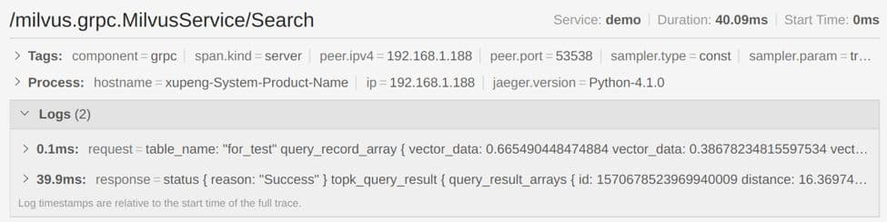

# Milvus 分布式向量检索-Mishards 架构介绍

> 作者：徐鹏
>
> 日期：2020-3-12

向量搜索引擎 Milvus 旨在帮助用户实现海量非结构化数据的近似检索和分析。单个 Milvus 实例可处理十亿级数据规模，而对于百亿或者千亿规模数据的需求，则需要一个 Milvus 集群实例，该实例对于上层应用可以像单机实例一样使用，同时满足海量数据低延迟、高并发业务需求。集群内部处理请求转发、读写分离、水平扩展、动态扩容，为用户提供内存和算力可以无限扩容的 Milvus 实例。Mishards 就是一个 Milvus 分布式解决方案。

本文将基于 Mishards 的分布式架构，集中介绍当中的各种组件。对于更细节的展示，将会在之后的系列文章中一一详解。

## 分布式架构概览

### 主要服务调用链

（由上到下分别为服务发现链，向量搜索链和向量插入链）

### 主要服务组件

- 服务发现框架: 比如 Zookeeper, ETCD, Consul 等框架。
- 负载均衡器: 比如 Nginx, HAProxy, Ingress Controller 等。
- Mishards 节点: 无状态, 可扩展。
- 只写 Milvus 节点: 单节点，不可扩容，为避免单点故障，需为该节点部署高可用 HA 方案。
- 只读 Milvus 节点: 有状态的节点，可扩展。
- 共享存储服务: 所有 Milvus 节点通过共享存储服务共享数据，可选择 NAS 或 NFS。
- 元数据服务: 所有 Milvus 节点通过该服务共享数据元信息。目前只支持 MySQL。该服务需要 MySQL 高可用方案。

### 可扩展组件

- Mishards
- 只读 Milvus 节点

### 组件介绍

#### Mishards 节点

Mishards 主要负责将上游请求拆分，并路由到内部各细分子服务，最后将子服务结果汇总，返回给上游。

如图所示，Mishards 接受到向量 TopK 搜索请求后，首先将请求切分成一些子请求，再将子请求按照一定的逻辑分发到下游服务并等待响应，待所有子响应收集完成后，聚合各子响应结果并返回给上游。

Mishards 是无状态的服务，本身并不保存数据也不参与复杂的计算。因此节点对于配置的要求不是太高，主要的算力消耗在结果集的归并上。因此，可以通过扩容 Mishards 节点数来支持高并发。

#### Milvus 节点

Milvus 节点负责数据的增删查改相关的核心操作，因此节点对于机器的配置要求比较高。首先，要有足够大的内存避免磁盘 IO 开销，其次 CPU 的配置也直接影响到操作性能。通常随着集群的扩大，需要增加更多的 Milvus 节点来提高系统的吞吐量。

- 只读节点和可写节点

  - Milvus 的核心操作是向量插入与搜索。搜索对于内存，CPU 和 GPU 的硬件要求非常高，插入以及其他一些操作则不需要那么高的配置。将搜索和其他操作分工到不同的节点可以更经济的进行部署。

  - 从服务质量上考量，当某个节点处理搜索时，相关硬件是满负荷运转的，当节点绝大部分时间都处于高负荷运转状态时，很难保证其他操作的服务质量。所以这里会区分出两种节点，搜索请求由只读节点处理，其他的请求由可写节点处理。

- 只能有一个可写节点

  当前版本 Milvus 的实现无法支持多个可写实例共享数据。
  部署时需要考虑可写节点的单点故障，需要为可写节点准备 HA 方案。

- 只读节点扩展

  当处理的数据规模特别大，或者对于系统低延迟要求特别高，可以将只读节点作为有状态的节点横向扩展。假设有四台机器，每台配置: CPU Cores: 16, GPU: 1, Memory: 64G. 横向扩展有状态节点时的集群对外视图如下图，算力和内存都线性扩展。数据被分割成８个分片，每个节点只处理２个分片的请求。

  

- 当某些分片的请求量很大时，可以为这些分片数据再部署无状态的只读节点提高吞吐率。以上四台机器为例，当组成一组无服务的集群，算力线性增加了，处理的数据规模没有改变，对于同一数据分片的处理能力线性增加。

#### 元数据服务

> 关键字：MySQL

关于 Milvus 元数据的相关概念，参见大规模向量检索场景下的数据管理（下篇）一文。在分布式系统中，Milvus 可写节点是元数据唯一的生产者，而 Mishards 节点，Milvus 可写节点和 Milvus 可读节点都是元数据的消费者。目前版本的 Milvus 只支持 MySQL 和 SQLite 作为元数据的存储后端，在分布式系统中，该服务只能部署成高可用 MySQL 服务。

#### 服务发现

> 关键字：Apache Zookeeper、etcd、Consul、Kubernetes

服务发现提供所有 Milvus 节点的信息，Milvus 节点上线时注册自己的信息，下线时注销，并通过定期检查服务的健康状态，及时发现异常节点。

服务发现有很多框架，etcd, Consul，ZooKeeper 等。Mishards 定义了相关的服务发现接口，并通过插件模式提供了扩展的可能性。目前默认提供了两种插件，分别对应了基于 Kubernetes 集群和静态配置。用户可以仿照这两种插件的实现，定制化自己的服务发现实现。目前相关接口定义还比较临时，需要后期重新设计。我会在 Mishards 插件篇详细讲解如何写一个自己的插件。

#### 负债均衡与服务分片

> 关键字：NGINX、HAPROXY、Kubernetes

服务发现和负载均衡配合使用，负载均衡策略可以配置成轮询、哈希和一致性哈希等。

负载均衡器负责将用户请求转发至 Mishards 节点。

每个 Mishards 节点通过服务发现中心拿到所有下游 Milvus 节点的信息，通过元数据服务知晓整个数据相关元数据。Mishards 实现服务分片就是对于这些素材的一种消费。Mishards 定义了路由策略相关的接口，并通过插件提供扩展。目前 Mishards 默认提供了基于存储最底层 segment 级别的一致性哈希路由策略。如图有 10 个数据段 s1, s2, s3… s10, 现在选择基于数据段的一致性哈希路由策略，Mishards 会将涉及 s1, s4, s6, s9 数据段的请求路由到 Milvus 1 节点, s2, s3, s5 路由到 Milvus 2 节点, s7, s8, s10 路由到 Milvus 3 节点。

用户可以仿照默认的一致性哈希路由插件，根据自己的业务特点，定制个性化路由。

#### 链路跟踪

> 关键字：OpenTracing、YAEGER、ZIPKIN

分布式系统错综复杂，请求往往会分发给内部多个服务调用，为了方便问题的定位，我们需要跟踪内部的服务调用链。随着系统的复杂性越来越高，一个可行的链路追踪系统带来的好处就越显而易见。我们选择了已进入 CNCF 的 OpenTracing 分布式追踪标准，OpenTracing 通过提供平台无关，厂商无关的 API ,方便开发人员能够方便的实现链路跟踪系统。

上图是 Mishards 服务中调用搜索时链路跟踪的例子，Search 顺序调用 get_routing, do_search 和 do_merge。而 do_search 又调用了 search_127.0.0.1。

整个链路跟踪记录形成下面一个树：

下图是每个节点 request/response info 和 tags 的具体实例：

OpenTracing 已经集成到 Milvus 中，我将会在 Milvus 与 OpenTracing 一文中详细讲解相关的概念以及实现细节。

#### 监控与报警

> 关键字：Prometheus、Grafana

Milvus 已集成开源 Prometheus 采集指标数据, Grafana 实现指标的监控，Alertmanager 用于报警机制。Mishards 也会将 Prometheus 集成进去。

#### 日志分析

> 关键字：Elastic、Logstash、Kibana

集群服务日志文件分布在不同服务节点上，排查问题需要登录到相关服务器获取。分析排查问题时，往往需要结合多个日志文件协同分析。使用 ELK 日志分析组件是一个不错的选择。

## 结语

Mishards 作为 Milvus 服务中间件，集合了服务发现，请求路由，结果聚合，链路跟踪等功能，同时也提供了基于插件的扩展机制。目前，基于 Mishards 的分布式方案还存在以下几点不足:

- Mishards 采用代理模式作为中间层，有一定的延迟损耗。
- Milvus 写节点是单点服务。
- 依赖高可用 MySQL 服务。
- 对于多分片且单分片多副本的情况，部署比较复杂。
- 缺少缓存层，比如对元数据的访问。

我们会在之后的版本中尽快解决这些已知的问题，让 Mishards 可以更加方便的应用生产环境。
