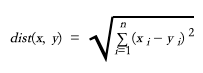
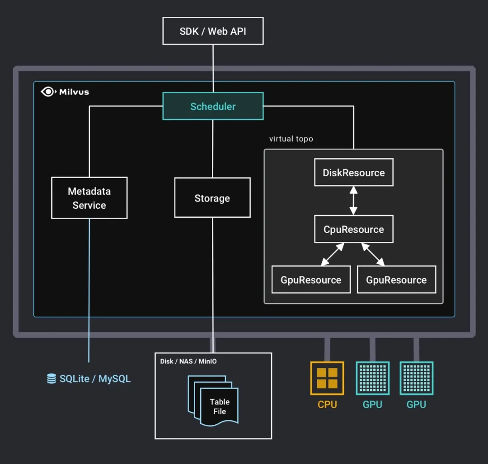
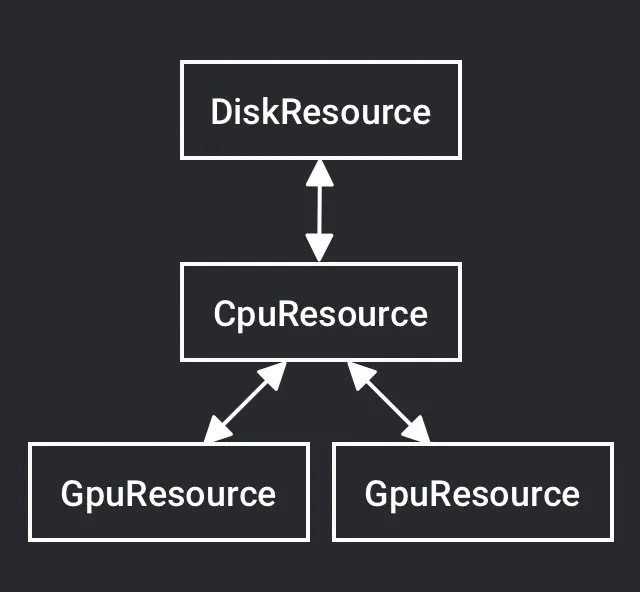
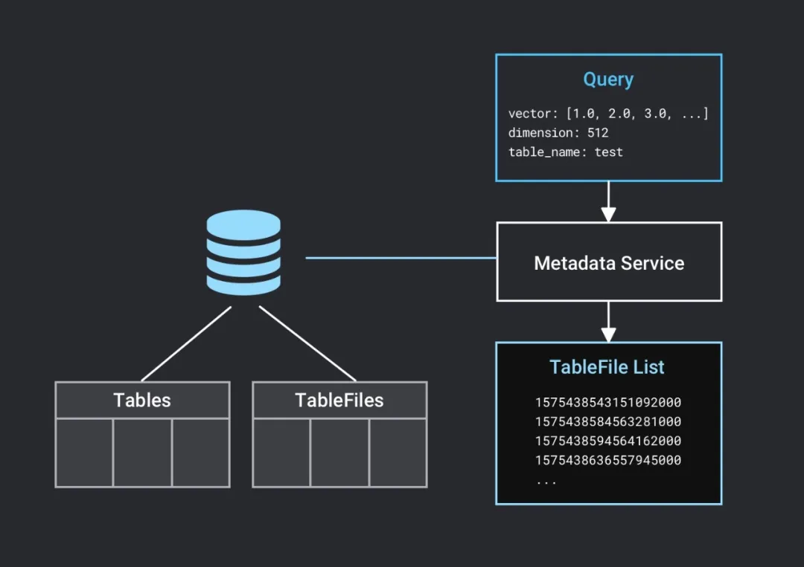
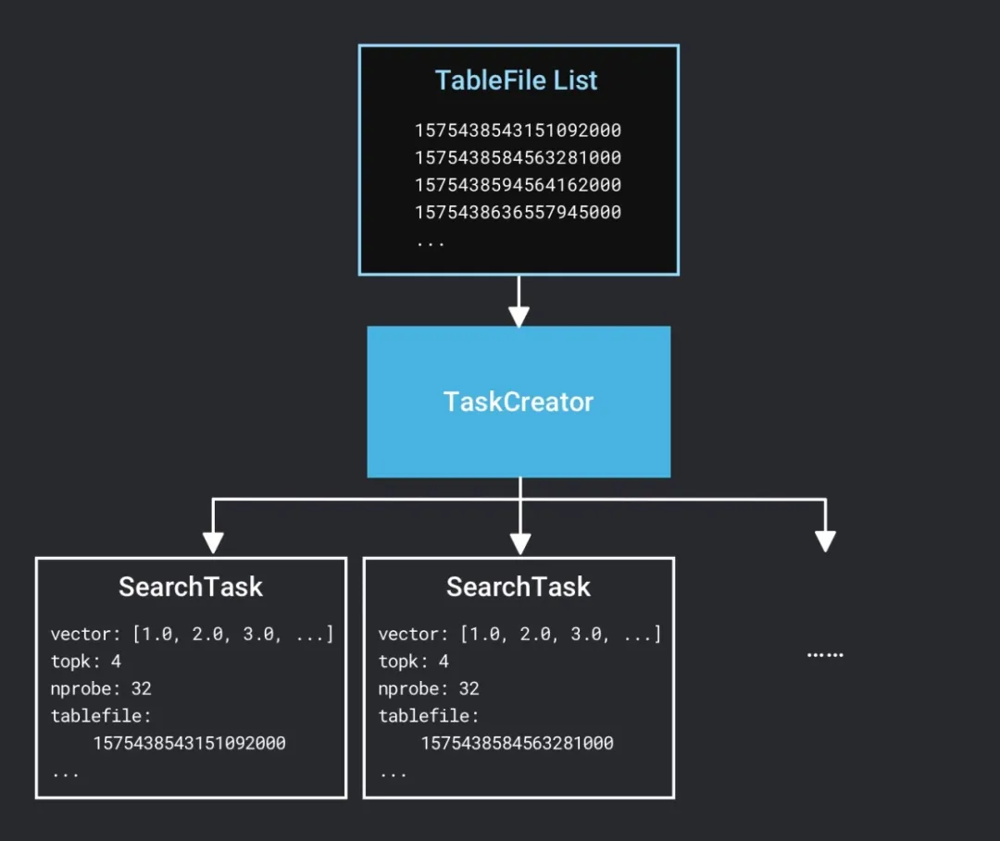
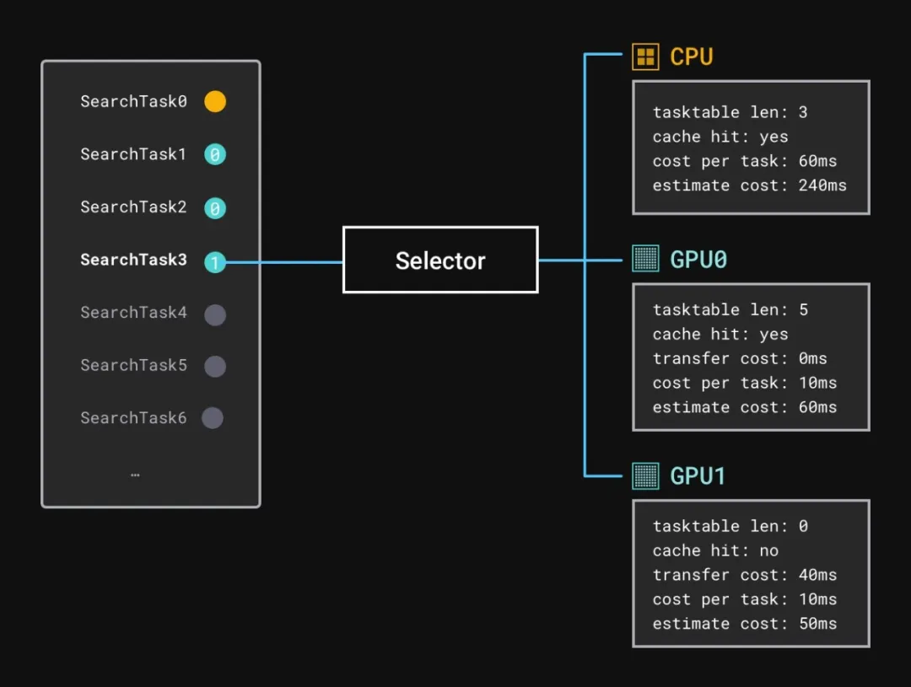
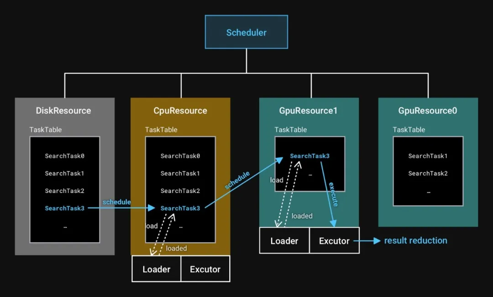
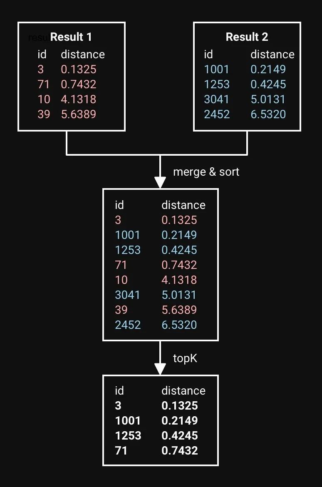
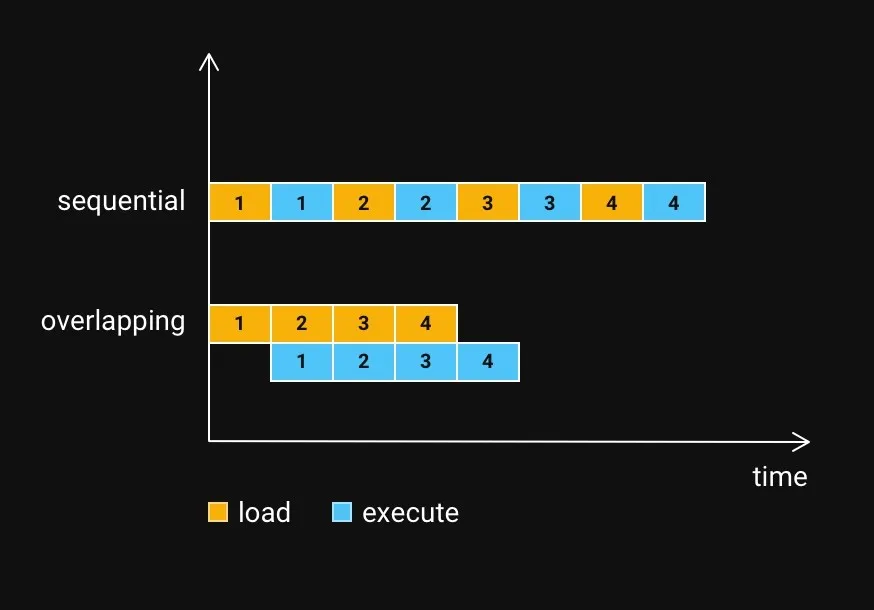

# Milvus 查询任务调度原理

> 作者：王翔宇
>
> 日期：2020-3-2

本文主要阐述在单机多卡的场景下，Milvus 是如何调度查询任务的。此外，我们还将讨论在调度实现过程中遇到的问题，解决方案和未来的发展方向。

## 背景

在[大规模向量检索](2019-11-07-massive-vector-search.md)这篇文章中提到过，向量的相似性搜索实际上是通过两个向量在高维空间的距离来判断的，向量搜索就是在高维空间中找到与目标向量距离最接近的 K 个向量。

衡量向量相似性的距离有很多种，以最典型的欧氏距离为例，其计算公式为：



其中 x 和 y 是两个向量，n 是向量的维度。

为了能找到集合中与目标向量最相似的 K 个向量，通常需要计算目标向量与集合中所有向量的欧式距离，然后根据距离对向量进行排序，获得距离最小的 K 个向量，即得到与目标向量最相似的 K 个向量。向量搜索的计算量与集合规模成正比，搜索的集合规模越大，所需要的计算量就越大。而 GPU 作为图形处理专用处理器，拥有大量的计算核心，正好可以提供计算所需要的大量算力，所以 Milvus 在实现的时候把多 GPU 异构计算的支持也考虑了进去。

## 基本概念

### 数据块（TableFile）

为了更好地支持大规模的数据检索，我们在 Milvus 的数据存储上做了一些工作。对于一个 Table 的数据，我们会在插入时按照大小进行分割，得到多个数据块。在进行向量搜索的时候，我们会在每一个数据块中进行目标向量的搜索，最后把每个数据块中获得的结果归并到一起得到最终结果。所以一次向量搜索的计算过程由 N 次独立的向量搜索（ N 为数据块个数）和 N-1 次结果归并组成。

### 任务队列（TaskTable）

每一个 Resource 上都有一个任务队列，任务队列中会记录属于这个 Resource 的任务。每个任务都有对应的状态（Start、Loading、Loaded、Executing 和 Executed）。一个计算设备上的 Loader 和 Executor 共享同一个任务队列。

## 查询调度机制



1. Milvus server 启动时，会根据配置文件中的 `gpu_resource_config` 启动对应的 GpuResource，DiskResource 和 CpuResource 启动暂时不可以通过配置修改。启动的 Resource 是配置文件中 `search_resources` 和 `build_index_resources` 的并集，在这里是`{gpu0, gpu1}`。

```yaml
gpu_resource_config:
  enable: true
  cache_capacity: 4
  search_resources:
    - gpu0
    - gpu1
  build_index_resources:
    - gpu0
```



2. 收到请求。前面文章提到过，关于 Table 的一些元数据（Metadata）存在一个外部的数据库中，单机场景下是 SQLite 或者 MySQL，分布式场景下是 MySQL。所以 Milvus server 在收到一条搜索请求后会验证 Table 是否存在、Dimension 是否一致，然后读出此 Table 的 TableFile 列表。



3. 创建 SearchTask。因为每个的 TableFile 的计算是独立进行，与其他 TableFile 无关的。所以，Milvus 为每一个 TableFile 创建一个 SearchTask。SearchTask 上包含搜索的目标向量、搜索参数以及 TableFile 的文件名。SearchTask 是任务调度的基本单位。



4. 选择计算设备。一个 SearchTask 在什么设备上计算取决于在每个设备上的 “预计完成时间”。”预计完成时间” 指这个任务从现在到计算完成的预计时间。

例如，一个 SearchTask 的数据块已经加载到内存里了，而此时 CPU 的任务队列中存在一个 SearchTask 等待计算，GPU 的计算队列是空闲状态，那么 CPU 的“预计完成时间”等于前一个 SearchTask 的预计消耗时间加上当前 SearchTask 的预计消耗时间，而 GPU 的“预计完成时间”等于数据块加载到 GPU 的时间加上当前 SearchTask 的预计消耗时间。某个 Resource 上单个 SearchTask 的预计消耗时间等于这个 Resource 上每个 SearchTask 的平均执行时间。然后选择一个“预计完成时间”最短的设备，分配 SearchTask 在这个设备上计算。

这里假设 GPU1 的估计计算完成时间比较短。



5. 将 SearchTask 加入到 DiskResource 的任务队列上。

6. SearchTask 被移动到 CpuResource 的任务队列上。CpuResource 上的加载线程会依次完成任务队列中每一个任务的数据加载。CpuResource 把对应的数据块文件读入内存。

7. SearchTask 被移动到 GpuResource 上。GpuResource 上的加载线程同样会依次完成数据从内存到显存的拷贝。GpuResource 把对应的数据块从内存读入显存。

8. SearchTask 在 GpuResource 上被执行。由于单个 SearchTask 的计算结果一般不会特别大，所以在这一步直接就将结果传输回到了内存。



9. SearchTask 的结果与整个搜索请求的结果进行归并。



10. 所有 SearchTask 都完成后，Milvus 会把整个搜索的结果返回给客户端。

## 索引构建机制

索引构建流程跟查询流程基本一致，只不过没有最后的归并阶段，就不在此赘述了。

## 性能优化

### 缓存

前面提到，数据块在计算之前需要被加载到对应的存储设备上，如内存、显存。为了避免重复的数据加载，Milvus 引入了基于 LRU（Least Recently Used，最近最少使用）的缓存。当缓存充满后，新的数据块会把老的数据块“挤”出去。用户可以根据当前系统存储空间的大小，通过配置文件设置缓存的大小。我们推荐设置足够大的缓存空间存储待查向量数据，从而有效减少数据加载时间，提高系统搜索性能。

### 数据加载与计算重叠

缓存并不能满足我们所以对于搜索性能的追求，内存不够大、数据规模大等因素都可能导致数据需要重新加载。我们需要尽可能减少加载数据时间对搜索性能的影响。由于数据加载无论是硬盘加载到内存还是内存加载到显存，都是 IO 操作，不怎么占用处理器的计算资源，所以我们考虑并行地做数据的加载和计算以提高资源利用率。

我们将一个数据块的计算分成了 3 个阶段（磁盘加载到内存，CPU 计算，结果归并）或 4 个阶段（磁盘加载到内存，内存加载到显存，GPU 计算且结果拷回，结果归并）。以 3 阶段为例，我们可以启动 3 个线程分别负责做这 3 件事情以达到类似 Instruction pipelining 的效果。由于结果集大多数情况下比较小，结果归并占用时间并不多，在一些情况下，计算与数据加载重叠能使得整个查询时间降到原查询时间的约 1/2。



## 问题与解决方案

### 不一样的传输速度

Milvus 早先的多卡任务分发策略是以 Round Robin 的方式分发。这个分发策略在我们一台 4 卡的服务器上工作地很好，查询性能比单卡提升约 4 倍，但是在我们的双卡的开发机上却没有 2 倍的性能提升。关于这个问题我们还做了一些实验，发现对于某一张卡的数据拷贝速度是 11 GB/s，而另一张卡只有 3 GB/s。在查阅了主板相关资料后最终确认，主板上和两张显卡的连接分别是 PCIe x16 和 PCIe x4，也就是说这两张卡的拷贝速度就会不一样。于是后来我们加入了”拷贝时间”来衡量每个 SearchTask 的最优计算设备。

## 未来的工作

### 更复杂的硬件环境

实际情况下的硬件环境可以更加复杂，像多路 CPU、NUMA 架构的内存、NVLink 和 NVSwitch 这类的卡间通信等这些硬件环境给系统留下了很多的优化空间。

### 查询的优化

在实验中我们发现了一些性能点，例如在 Server 同时接收到很多个对于同一张表的查询时，这些查询在一定情况下是可以合并的，利用好数据局部性可以使系统获得更好的性能。此类的优化我们会在未来的开发过程中慢慢实现。

到这里，我们已经了解了查询任务在单机多卡的场景下是如何被调度和执行的。Milvus 内部更多的实现原理我们会在其他文章中给出。
