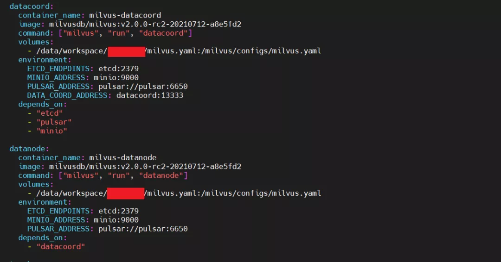

# 技术分享｜如何对 Milvus 2.0 进行参数配置

> 编者按：
>
> 端口冲突怎么办？日志输出怎么搞？参数的合理配置能够有效解决这些常见问题。
>
> Milvus 资深爱好者梦醒君最近一直在使用 Milvus 2.0 RC 版本，有一些关于参数配置的心得体会想分享给大家。
>
> 本文转载自 Milvus 用户 **@迷茫的梦醒** 的知乎专栏，已获得原作者授权。

## 背景

以前，使用 Milvus 1.1.1 的时候，可以直接在容器内部修改配置文件，然后重新启动容器即可更新配置。最近，Milvus 发布了 Milvus 2.0 RC 版本，看了官网的介绍，似乎功能很强大，所以我很想亲自上手去试试。但是在上手过程中，我发现了一个问题：使用 docker-compose 启动 Milvus 2.0 并在 docker 容器内部修改配置文件时候，我无法进行修改，就算强制修改配置文件也无法生效。翻阅相关资料后我了解到 Milvus 2.0 RC 版本无法检测配置文件的改动，未来在稳定版本中会进行这方面的优化。

接下来，我将分享在 Milvus 2.0 单机版、分布式版本中修改 Milvus 2.0 配置文件的一些经验，以及如何在配置文件中修改日志文件路径。

## Milvus 2.0 单机版修改 milvus.yaml 配置文件

首先，我们必须先修改 Milvus.yaml 配置文件，才能用 docker-compose启动，否则是不会生效的（划重点！）

然后，去 Github 上 Milvus 的 repo 中复制一份 Milvus.yaml 文件到本地（服务器或者本机），Milvus.yaml 文件的链接：https://github.com/milvus-io/milvus/blob/master/configs/milvus.yaml

修改 Milvus.yaml 中的配置参数，如下图所示把日志形式从 text 改成 json：

<<<<<<< HEAD

Milvus.yaml 配置文件修改完毕之后，也需要修改 docker-compose.yml 文件。docker-compose.yml 文件修改的部分为：将本地已经修改的配置文件的路径 /data/workspace/***/milvus.yaml ，映射到相对应的 docker 容器内部的配置文件路径 /milvus/configs/milvus.yaml 中：

让我们来验证一下是否生效，用 docker-compose up -d 命令启动 Milvus 2.0，然后用 docker logs 查看日志是否变成 json 形式：

=======

Milvus.yaml 配置文件修改完毕之后，也需要修改 docker-compose.yml 文件。docker-compose.yml 文件修改的部分为：将本地已经修改的配置文件的路径 /data/workspace/***/milvus.yaml ，映射到相对应的 docker 容器内部的配置文件路径 /milvus/configs/milvus.yaml 中：

让我们来验证一下是否生效，用 docker-compose up -d 命令启动 Milvus 2.0，然后用 docker logs 查看日志是否变成 json 形式：

>>>>>>> 7b5c38c602340687a838caa09573cb2c8fb33578

## Milvus 2.0 分布式版本修改 milvus.yaml 配置文件

首先，还是跟单机版本一样，根据需求去修改 milvus.yaml 文件，这里一样将日志形式从 text 修改成了 json：

<<<<<<< HEAD

然后，修改对应的 docker-compose.yml 文件，修改方式如下图所示：在 rootcoord 、datacoord、datanode 、querycoord、querynode、 indexcoord、 indexnode proxy 这些组件中增加 volumes：

=======

然后，修改对应的 docker-compose.yml 文件，修改方式如下图所示：在 rootcoord 、datacoord、datanode 、querycoord、querynode、 indexcoord、 indexnode proxy 这些组件中增加 volumes：

>>>>>>> 7b5c38c602340687a838caa09573cb2c8fb33578

最后，启动 Milvus 和查看日志的命令和单机版本一致。

## 如何在 Milvus.yaml 中修改日志文件的路径？

首先，在 Milvus.yaml 配置文件中修改日志文件的 rootpath，我这里将其修改为 /milvus/logs (也可以自定义)：

<<<<<<< HEAD

然后，修改 docker-compose.yml 文件，如果需要把日志文件导出 ，那么 /milvus/logs 也需要挂载 volume：

=======

然后，修改 docker-compose.yml 文件，如果需要把日志文件导出 ，那么 /milvus/logs 也需要挂载 volume：

>>>>>>> 7b5c38c602340687a838caa09573cb2c8fb33578
最后，用 docker-compose up -d 命令进行启动 Milvus 即可，就可以查看设置路径下的日志文件了。
