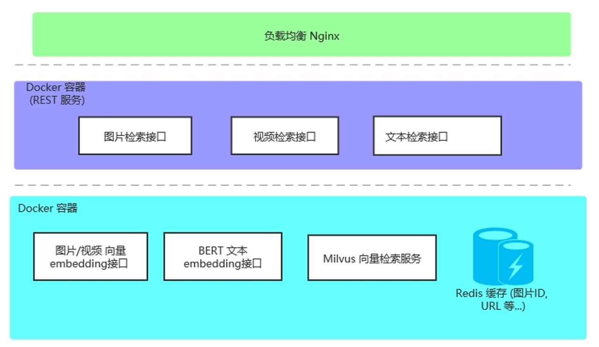
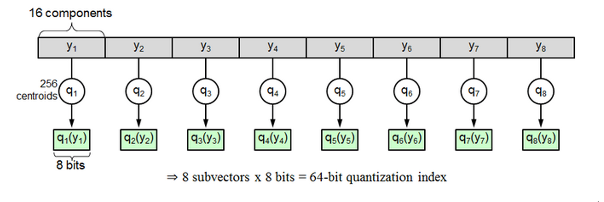
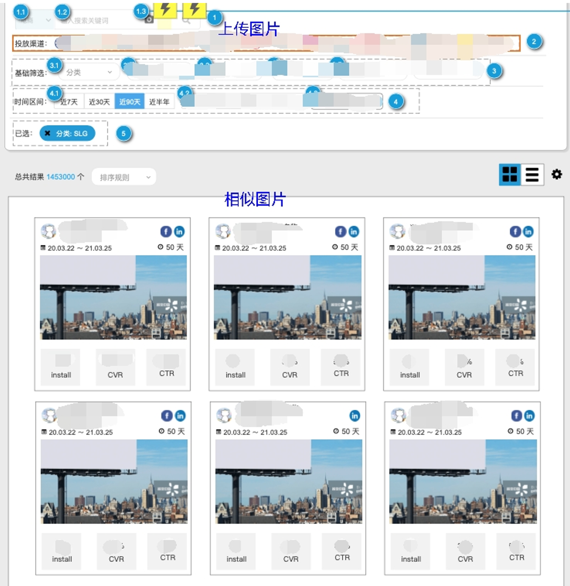

# 千万量级图片视频快速检索，轻松配置设计师的灵感挖掘神器

> 作者介绍：
>
> James Zhang，飞书深诺集团的算法工程师 ，毕业于芬兰坦佩雷大学，感兴趣的方向包括自然语言处理、计算机视觉等机器学习相关领域以及算法工程化。
>
> 飞书深诺集团是专注海外数字营销解决方案的综合服务集团，为中国出海企业提供可定制组合的全链路服务产品，满足游戏、APP、电商、品牌等典型出海场景需求。

## Milvus 在电商场景中的千万量级素材搜索实践

### 项目背景

在服务电商客户的场景下，创意部门常常要为客户制作素材，如：广告图、宣传视频、宣传文案等。创意部门往往通过以图搜图、以视频搜视频、文本搜文本的方式发掘素材，为设计师们提供创意上的参考。同时，热度、效果值等其他条件也可以用来辅助搜索，帮助创意部门充分选择合适的素材。此项目的动机正是利用 Milvus 向量数据库在内的一系列技术，为创意部门提供一个素材的综合搜索系统。

### 技术选型

由于业务接口需要实时返回，并承受一定程度的并发负载，因此我们认为 Milvus 是比较合适的向量检索工具。它对 FAISS、ANN 等工具进行了封装，建立自己的存储文件结构，同时提供了方便的服务化接口，可以算得上“开箱即用”了。在保持检索速度快的同时，Milvus 可以通过参数设置，对向量检索的准确性、资源占用做一定的 Trade-off，比较适合在实际工程中使用。

我们在返回相似向量的同时，还需要图片/视频的一些对应信息，我们通过 KV（Key-Value）的形式将这些信息放在 Redis 缓存里，加快获取的速度。在 Web 接口封装方面，考虑到团队内大部分为 Python 程序员，因此我们选用了 Nginx + Flask + Gunicorn + supervisor 的 Web 经典套餐。

**使用到的各工具和框架**

* Milvus（图片/视频/文本的向量相似检索）
* Redis（业务缓存）
* Nginx（负载均衡）
* Flask + Gunicorn （Web 框架 + 并发服务）
* Supervisor（服务的进程启动与异常自动重启）
* Docker（容器隔离部署）

### 项目实现

在我们的项目中，图片使用 EfficientNet 来提取特征向量；视频通过提取关键帧之后，再将每一帧图片进行向量提取之后叠加；文本采用 BERT 做特征提取。

**架构示意如下图所示：**

**选择合适的索引：**

在得到图片/视频/文本向量检索结果后，上层调用还要做一些业务操作，留给向量检索的接口的时间就不能太多，系统需要做到 1s 内返回。由于向量检索对速度的要求比较高，同时服务部署的机器内存又有一定的限制，我们选用了 IVF_PQ 作为向量索引。

IVF_PQ 是一种有损压缩的向量索引，它将所有向量分解成 m 段，每一小段分别进行聚类，每小段由所属的聚类中心来表示，称为索引值，用 Codebook （码表）来表示 。举例说明这种压缩方式：一个 D=128 维的原始向量被切分成了 M=8 个 D=16 维的短向量，同时每个 16 维短向量都对应一个量化的索引值，索引值即该短向量距离最近的聚类中心的编号，每一个原始向量就可以压缩成 8 个索引值构成的压缩向量，即每个向量都用这 8 个索引值来表示，相对于原始值有一定的误差。

在实际使用的时候，IVF_PQ 这种索引方法预先计算好的各个聚类中心间的距离，通过查找表得出两个向量索引值的距离，来近似替代两个向量的真实距离，这种方法加快了计算速度；在使用中可以通过参数 m 的设置，使得向量压缩成很小的比例，也大量减少了内存占用（约为向量原始空间大小的 5%~10%）。下图为 IVF_PQ 索引压缩示例：

根据 Milvus 官方提供的公式：

单个数据段计算量可估算为：目标向量数量 × (nlist+ （段内向量数 ÷nlist）× nprobe)

数据段的数量可估算为：集合数据总量 ÷ index_file_size

对集合查询所需的计算总量则为：单个数据段计算量 × 数据段数量

我们计算得出合适的索引参数是 nlist=1024，m=8。

**使用分区提高速度：**

目前素材中，图片总量接近 4kw，视频总量大约 1kw，文本总量大约 3kw，为了提高检索速度，分区变得十分必要。我们通过一些业务属性，根据属性值做笛卡尔积操作来建立分区：

例如，我们向量对应的 Item 有两个属性：

* 对于属性 A，取值 1，2，3，4

* 对于属性 B，取值 1，2，3

建立分区 A1_B1，A1_B2，A1_B3，A2_B1，A2_B2，A2_B3，...... ，A4_B3，一共 12 个。通过分区操作，我们将每个分区的向量规模控制在 500w 以下，进一步提高了检索速度。

需要注意的是，用来建立分区的属性应该是不会变动的基本属性。因为如果发生变动，重新建立分区、导入数据和建立索引将是非常漫长的过程，所以分区确定之后不要轻易改变。另外，分区及属性值不能太多，否则各个属性值相乘（笛卡儿积）会让数量变得非常庞大，使程序变得过于复杂。如果要实现更多的素材属性检索或筛选，我们在 Milvus 向量搜索的结果上另外封装一层业务接口来实现。

### 系统效果

向量检索服务以 REST 接口的形式对外提供，前端团队调用接口，将结果展示在界面上。（请自行脑补一下谷歌的以图搜图，百度的以影搜影等等……）

**性能指标**
目前我们的图片总量大约在 3kw+，视频总量大约在 1kw，向量维数为 2048 维，文本总量为 3kw 左右，向量维数为 768 维。图片检索耗时 0.2s 左右；视频检索耗时 0.1s 左右；文本向量检索耗时 <0.1s。

关于 Milvus 的一些经验与总结
Milvus 集成各种常见向量索引，能满足工程中大部分的需求，存储操作和检索速度都达到了工业级的水准，提供服务化的接口，基本上做到了开箱即用。不过 Milvus 目前还不支持其他类型（字符型、整型）的属性检索，官方表示新版本目前正在研发当中，期待早日上线。

总体来说，对于需要快速构建向量检索服务、又不想花太大成本构造的轻量级项目来说，Milvus 是一个很好的选择。

### 参考文献 

[1] Product quantization for nearest neighbor search. Hervé Jégou, Matthijs Douze, Cordelia Schmid

[2] https://Milvus.io/cn/docs/v1.1.1/tuning.md 

